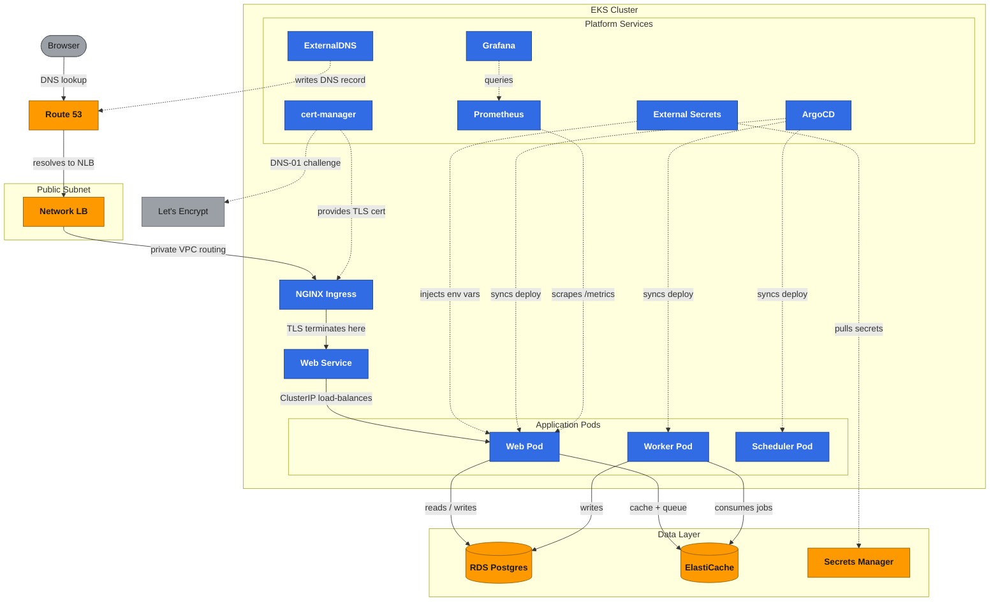
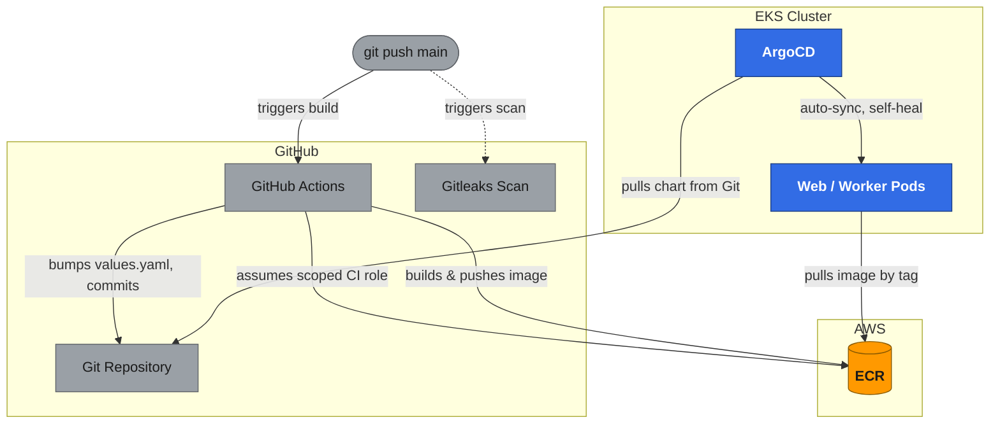

# Architecture

Two diagrams, generated from what's actually deployed (`infra/`, `platform/bootstrap`, `app/helm-chart`, `.github/workflows/`) — not a generic reference architecture. See `README.md` for the full narrative and the non-obvious decisions behind each piece.

## Diagram 1 — Runtime traffic flow

What happens, end to end, when a browser hits `devops.lvtvv.com`, plus the control-plane connections (dashed) that keep the app deployed, secured, and observed.

**Legend:** orange = AWS-managed service (runs outside any pod, reached over the AWS API or network — Route 53, the NLB, RDS, ElastiCache, Secrets Manager). Blue = in-cluster Kubernetes component (runs as a pod, whether it's application code or a platform controller). Gray = external/third-party (the browser, Let's Encrypt). Solid arrows are the request path. Dashed arrows are control-plane traffic — deploys, secret sync, DNS/cert automation, metrics scraping — not user traffic. Note the NLB does TCP passthrough only; TLS terminates at the NGINX Ingress because ACM (and therefore an ALB) is denied in this AWS account. ElastiCache has no in-transit encryption, which is why its edge isn't labeled "TLS."

## Diagram 2 — CI/CD & GitOps pipeline

How a `git push` to `main` turns into running pods, and why nothing outside the cluster ever holds a credential that can reach it.

**Legend:** gray = GitHub-side (developer, Actions runner, gitleaks, the repo itself). Orange = AWS-managed (ECR). Blue = in-cluster (ArgoCD, the pods it manages). Every arrow that crosses into the `EKS Cluster` box originates *inside* that box — `ArgoCD` reaches out to Git to check for changes, and the pods themselves pull their image from ECR. No arrow originates outside the cluster and terminates inside it: CI's own credentials (an assumed, ECR-scoped, 1-hour-session IAM role) never touch Kubernetes at all. The gitleaks scan runs on every push and PR but is a separate, non-blocking workflow — it doesn't gate the build-and-deploy path. There is no test step in the pipeline; the repo currently has zero automated tests (tracked in `README.md`'s "Known gaps").
