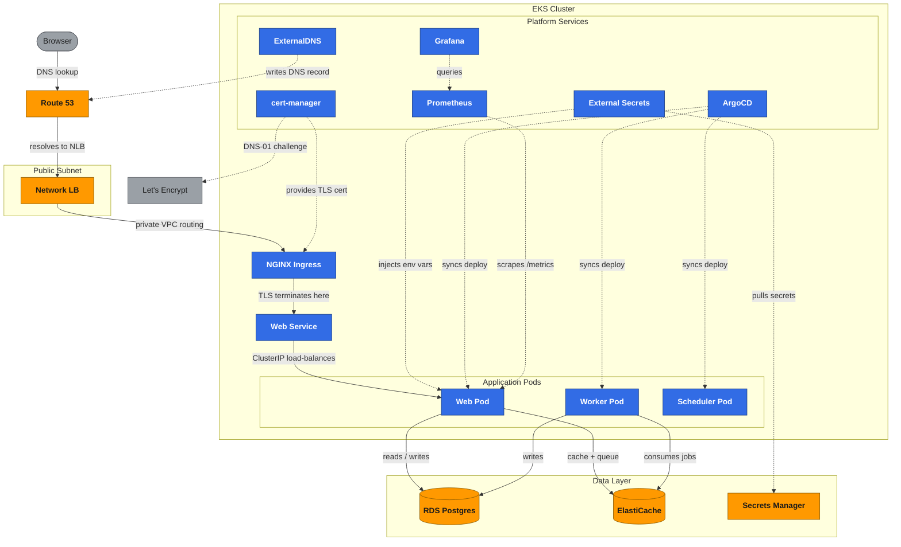

# Status-Page on Amazon EKS

Production infrastructure for the open-source [Status-Page](https://github.com/Status-Page/Status-Page) app (Django) — a DevOps final project.

**Live:** https://devops.lvtvv.com · **ArgoCD:** https://argocd.devops.lvtvv.com · **Grafana:** https://grafana.devops.lvtvv.com

## Stack

Terraform · Amazon EKS 1.36 (managed node group) · ArgoCD (GitOps) · Helm · AWS Load Balancer Controller · NGINX Ingress Controller · cert-manager + Let's Encrypt · ExternalDNS · External Secrets Operator · EBS CSI · Prometheus + Grafana + Alertmanager · RDS PostgreSQL (Multi-AZ) · ElastiCache Redis · Route 53

CI runs on GitHub-hosted runners — no self-hosted runners in the cluster.

Architecture diagrams:
- Interactive (draggable): https://claude.ai/code/artifact/eaa42d4d-d5c7-4bc7-a79d-a30f864ab631 — every component from DNS to Postgres, drag any box to rearrange, connections and traffic dots follow live.
- Hebrew: https://claude.ai/code/artifact/9d3d9810-9616-44ed-8519-729db13e1577
- English: https://claude.ai/code/artifact/58032f1c-a272-46a8-9a1b-ffb18c7c5b3f
- Full write-up with both diagrams below plus the CI/CD one: [ARCHITECTURE.md](ARCHITECTURE.md)

## Runtime architecture

What happens, end to end, when a browser hits `devops.lvtvv.com`, plus the control-plane connections (dashed) that keep the app deployed, secured, and observed. CI/CD & GitOps pipeline diagram is in [ARCHITECTURE.md](ARCHITECTURE.md).



Orange = AWS-managed service. Blue = in-cluster Kubernetes component. Gray = external/third-party. Solid arrows are the request path; dashed arrows are control-plane traffic, not user traffic.

## How a change reaches production

```
push to main ──▶ GitHub Actions ──▶ build image ──▶ ECR
                       │
                       └──▶ commit new tag into app/helm-chart/values.yaml
                                          │
                                          ▼
                            ArgoCD (in-cluster) notices the commit
                                          │
                                          ▼
   ExternalSecret ──▶ migration hook ──▶ web / worker / scheduler
```

CI never holds cluster credentials. It builds, pushes, and commits a tag; ArgoCD pulls. Git is the source of truth for what is deployed.

Inbound traffic: **Route 53 → NLB → NGINX (terminates TLS) → Django**, with RDS and ElastiCache reached privately from the nodes.

## Repo layout

```
infra/
  bootstrap/    S3 state backend (the one config with local state)
  vpc-eks/      VPC, EKS cluster, node group, addons
  data-dns/     RDS, ElastiCache, Secrets Manager, Route 53 zone
  iam/          Policy documents + apply script (deliberately not Terraform)
platform/
  bootstrap/    Helm values and manifests for the cluster-level controllers
app/
  Dockerfile, Django production config, and the application Helm chart
.github/
  workflows/    CI (build → assume role → push to ECR → bump tag) and secret scanning
```

## Decisions worth knowing before changing anything

These are the non-obvious ones. Each is explained in full in the relevant directory's README or in the commit that introduced it.

**IAM is not managed by Terraform.** The course admin asked that it stay out of automation, and separately the AWS provider genuinely cannot manage IAM in this account — it reads a role's policies back after every create, and those list actions are denied. `infra/iam/` keeps the policies as reviewable JSON with an idempotent script instead.

**No IRSA.** `iam:CreateOpenIDConnectProvider` is denied, so every controller authenticates through the shared node role. That is the pre-2019 EKS pattern; the trade-off is real and stated in `infra/iam/README.md`.

**NGINX ingress is F5's, not the community one.** `kubernetes/ingress-nginx` was archived in March 2026 and receives no further security fixes. `nginx/kubernetes-ingress` is actively maintained and registers the same `nginx` class, so nothing in the application chart changed. Annotation syntax differs (`nginx.org/*`).

**TLS terminates in-cluster, behind an NLB.** ACM is denied in this account and an ALB can only load certificates from ACM, so an ALB cannot serve HTTPS here at all. cert-manager issues from Let's Encrypt instead, which requires TLS to terminate at the ingress — and therefore an NLB passing TCP through rather than an ALB.

**Certificates use the DNS-01 challenge.** HTTP-01 needs a second Ingress for the same host, which F5's controller rejects outright. DNS-01 writes a TXT record instead, using Route 53 permissions the node role already had.

**Always issue against `letsencrypt-staging` first.** Let's Encrypt caps 50 certificates per week per *registered* domain, and the registered domain is `lvtvv.com` — the mentor's. Debugging against production spends his quota, not ours.

**Every public hostname costs one Ingress, and nothing else.** Grafana was put
on its own subdomain by adding an Ingress to a values file. ExternalDNS wrote
the Route 53 record, cert-manager issued the certificate, and the existing
ingress controller routed by hostname - no second load balancer, no DNS change
by hand, no certificate to renew. That is the return on those three
controllers, and it is worth knowing before adding a fourth hostname.

**Node capacity is fixed at three, with prefix delegation enabled.** The VPC CNI gives every pod a real VPC IP, capping a t3.medium at 17 pods. Prefix delegation raises that to 110. No Cluster Autoscaler: the pod ceiling was the actual constraint, and it is fixed at the root.

**State locking uses S3, not DynamoDB.** DynamoDB is denied for this user, and since Terraform 1.10 `use_lockfile` makes the lock table unnecessary anyway.

**`/metrics` took three fixes to actually work, not one.** In order: nginx forwarded the scrape's pod-IP Host header straight to Django, which 400'd against `ALLOWED_HOSTS` — same failure mode as the readiness probe, fixed the same way (pin the Host header). Then the ServiceMonitor path was missing a trailing slash, 404. Then even `/metrics/` 404'd — django-prometheus registers its view at `metrics` with no slash, and our patch mounts that under `path('metrics/', ...)`, so the real route Django concatenates is `/metrics/metrics`. Confirmed by hitting gunicorn directly inside the pod, bypassing nginx entirely.

**The nginx sidecar's config doesn't hot-reload.** It's mounted via `subPath`, which never receives live ConfigMap updates — no amount of waiting fixes it, only a pod restart does. A checksum annotation on the pod template (hash of the rendered ConfigMap) changes the pod spec whenever the config does, so the Deployment rolls itself instead of quietly serving stale nginx config.

**web/worker resource requests are sized from real usage, not guesses.** Pulled from 24h of Prometheus data: web was requesting 48% below its ~393Mi peak (scheduler was underestimating its real footprint), worker was reserving ~3x its ~87Mi peak (holding capacity nobody used). Re-check against Prometheus before changing either.

## Running it

```bash
cd infra/bootstrap  && terraform init && terraform apply   # once, creates the state bucket
cd ../vpc-eks       && terraform init && terraform apply
cd ../data-dns      && terraform init && terraform apply
cd ../iam           && bash apply.sh
cd ../../platform/bootstrap && GRAFANA_ADMIN_PASSWORD=... bash install.sh
```

`infra/iam` must run before `platform/bootstrap`, or the controllers start without the AWS permissions they need.

## Work split

| Owner | Scope | Branch |
|---|---|---|
| Stav | Terraform: VPC, EKS, node group, addons | `infra/vpc-eks` |
| Stav | IAM: node role policies, CI role (`sts:AssumeRole`) | `infra/iam` |
| Stav | RDS, ElastiCache, Secrets Manager, state backend, Route 53 | `infra/data-dns` |
| Stav | Bootstrap: ArgoCD, LB Controller, NGINX, cert-manager, ExternalDNS, ESO, kube-prometheus-stack | `platform/bootstrap` |
| Ilan | Dockerfile, Django production config | `app/container-config` |
| Ilan | Helm chart: Deployments, Ingress, Service, migration hook, probes, ExternalSecret | `app/helm-chart` |
| Ilan | GitHub Actions: build → assume role → push → bump tag | `app/cicd` |
| Ilan | Secret-leak enforcement: gitleaks CI scan, pre-commit hook, `SECURITY.md` | `security/secret-scanning` |
| Ilan | Application metrics: django-prometheus, `/metrics` on its own cluster-internal port, ServiceMonitor | `app/prometheus-metrics` |

## Known gaps

Honest state, not aspirational — these are real and open, not yet worked on:

- **No alerting.** kube-prometheus-stack's Alertmanager runs with persistent storage but no `PrometheusRule`/receiver configured — metrics are collected, nobody gets paged.
- **No PodDisruptionBudget** on the web Deployment, despite `replicaCount: 2`.
- **No pod-level `securityContext`** (`runAsNonRoot`, dropped capabilities) in the chart — the image itself runs non-root, but nothing enforces that at the Kubernetes level if the image ever changes.
- **No image vulnerability scanning** (Trivy/Grype) in CI, and no ECR scan-on-push.
- **Zero automated tests** in the repo. Cheapest first win: unit-test `app/patches/enable_prometheus_metrics.py`'s anchor-matching — it's a pure function, feed it fixture text, assert the patched output.

## Workflow

Branch → PR → review by the other person → merge. No direct pushes to `main`.

## Teardown

`terraform destroy` will not complete cleanly: IAM delete and detach actions are denied in this account, so the two EKS roles and the CI role survive and need the course admin to remove them. Everything else — VPC, cluster, RDS, ElastiCache, Route 53 zone, S3 bucket — destroys normally.
